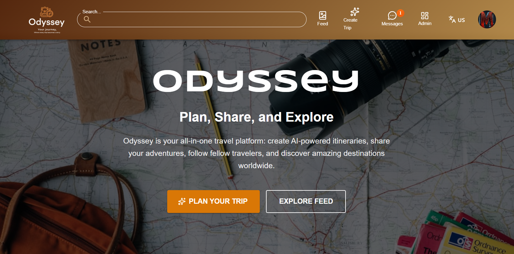
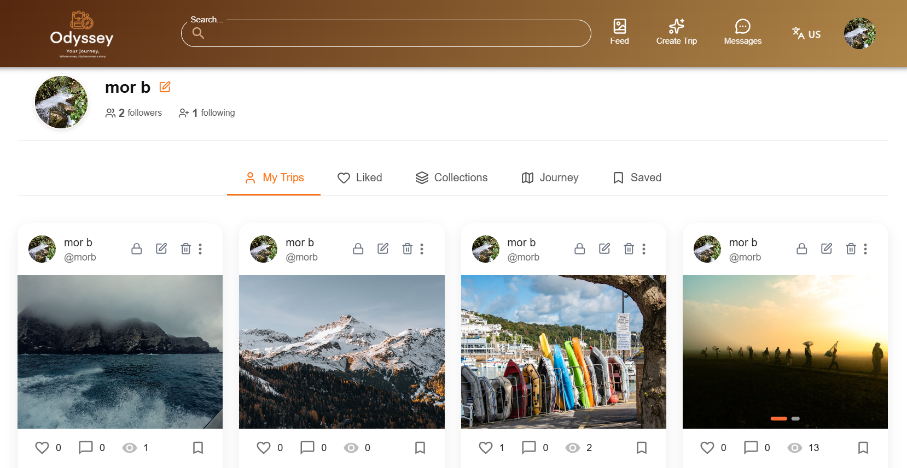
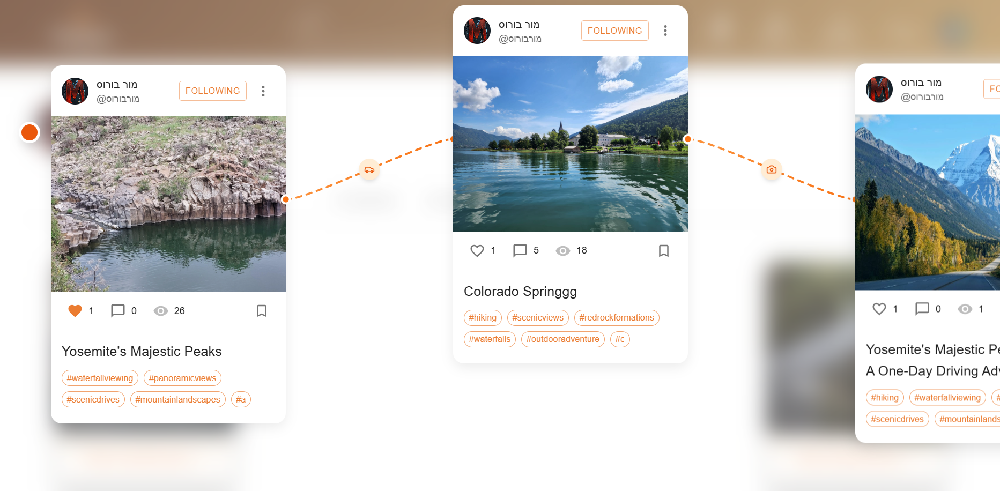
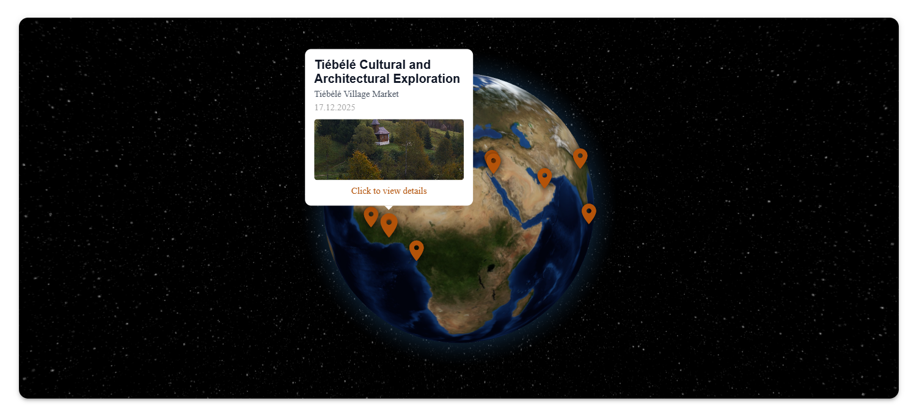

<h1 align="center">Odyssey</h1>

  <strong>A Full-Stack Social Travel Platform for Planning, Exploration, and Sharing</strong>

  🌍 Plan • 🧭 Explore • 🤝 Share

<h2>Overview</h2>

<strong>Odyssey</strong> is a full-stack social travel platform that enables users to plan trips,
share travel experiences, and explore destinations through both interactive and data-driven tools.

The platform combines modern web technologies, real-time communication, AI-powered features,
and advanced visualizations to deliver a rich and engaging user experience.
It supports multilingual usage (English and Hebrew) and includes both user-facing and administrative systems.

<h2>System Architecture</h2>

<h3>Client (Front-End)</h3>
<ul>
  <li>React with TypeScript (Vite)</li>
  <li>Component-based architecture</li>
  <li>Multilingual support (English & Hebrew)</li>
  <li>Dynamic UI with real-time updates</li>
</ul>

<h3>Server (Back-End)</h3>
<ul>
  <li>Node.js with Express</li>
  <li>RESTful API architecture</li>
  <li>JWT-based authentication and authorization</li>
  <li>Socket.IO for real-time communication</li>
</ul>

<h3>Database & Services</h3>
<ul>
  <li>MongoDB for persistent data storage</li>
  <li>Cloudinary for image management</li>
  <li>Redis for caching and real-time optimizations (optional)</li>
  <li>AI services for content generation and trip planning</li>
</ul>

<h2>Main Features</h2>

<h3>User Management & Social Network</h3>
<ul>
  <li>User registration and login</li>
  <li>Google OAuth authentication</li>
  <li>User profiles with personal information and activity</li>
  <li>Followers and following system</li>
  <li>Personalized content feed</li>
</ul>

<h3>Trip Creation & Planning</h3>
<ul>
  <li>Manual trip creation with full control over details</li>
  <li>AI-powered trip planning based on user preferences</li>
  <li>Trip cost estimation based on destinations and duration</li>
  <li>Public and private trip visibility</li>
</ul>

<h3>AI-Powered Features</h3>
<ul>
  <li>AI-assisted trip planning</li>
  <li>AI-generated titles and descriptions for collections</li>
</ul>

<h3>Collections</h3>
<ul>
  <li>Create and manage custom collections of trips</li>
  <li>Add titles and descriptions manually or using AI</li>
  <li>Organize saved trips into meaningful groups</li>
</ul>

<h3>Interactive Globe</h3>
<ul>
  <li>3D interactive globe visualization</li>
  <li>Display visited destinations on a global map</li>
  <li>Clickable locations linked to specific trips</li>
</ul>

<h3>Real-Time Communication</h3>
<ul>
  <li>Private messaging between users</li>
  <li>Live updates using Socket.IO</li>
</ul>

<h3>Social Interaction & Moderation</h3>
<ul>
  <li>Like and save trips and posts</li>
  <li>Report posts for inappropriate content</li>
  <li>Content moderation handled through the admin system</li>
</ul>

<h3>Media Upload</h3>
<ul>
  <li>Upload images for trips and posts</li>
  <li>Secure media handling via server and Cloudinary</li>
</ul>

<h2>Admin Panel</h2>

The system includes a comprehensive <strong>Admin Panel</strong> designed for efficient
management and monitoring of platform activity.

<ul>
  <li>Secure admin authentication and protected routes</li>
  <li>User management (view, block, remove users)</li>
  <li>Post management and moderation</li>
  <li>Handling and reviewing reported posts</li>
  <li>Separate management sections for users, posts, and reports</li>
  <li>Interactive graphs and dashboards for each category</li>
  <li>Data visualization to support informed administrative decisions</li>
</ul>

<h2>Screenshots</h2>

| Homepage | User Profile |
|----------|--------------|
|  |  |

| Collections | Interactive Globe |
|-------------|-----------------|
|  |  |

<h2>Live Demo</h2>

<em>Link to the deployed application:</em> 
<a href="https://odyssey-client.onrender.com" target="_blank">
  https://odyssey-client.onrender.com
</a>

<h2>Technologies</h2>

<ul>
  <li><strong>Frontend:</strong> React, TypeScript, Vite</li>
  <li><strong>Backend:</strong> Node.js, Express</li>
  <li><strong>Database:</strong> MongoDB</li>
  <li><strong>Real-Time:</strong> Socket.IO</li>
  <li><strong>Authentication:</strong> JWT, Google OAuth</li>
</ul>

<h2>Project Structure</h2>

<pre>
Odyssey/
├── Client/    # React front-end
├── Server/    # Express back-end
└── README.md
</pre>

<h2>Acknowledgments</h2>

Special thanks to my project partners for their collaboration, commitment,
and teamwork throughout the development of this project.

<ul>
  <li>
    <a href="https://github.com/michalHanau" target="_blank">
      Michal Hanau
    </a>
  </li>
  <li>
    <a href="https://github.com/MiriamSanders" target="_blank">
      Miriam Sanders
    </a>
  </li>
</ul>

This project would not have been possible without the shared effort,
open communication, and mutual support of the entire team.

